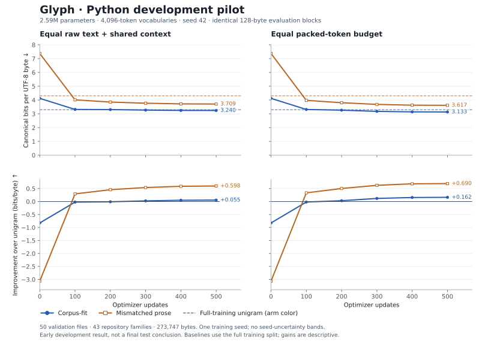

# Glyph

**Does a corpus-fit tokenizer improve a small language model, or mainly give it a better text encoding?**

Glyph trains the same transformer with two reversible byte-level BPE tokenizers. They have exactly the same vocabulary size and settings. One tokenizer learns from the target training corpus; the other learns from mismatched WikiText prose with the same raw-character training budget.

[Vowel](https://github.com/marcelo-earth/vowel) varies vocabulary size and changes model width to hold approximate parameter count fixed. Glyph fixes the vocabulary size and the architecture. Vowel's historical results are not a validated numerical baseline here; see the [independent audit](research/scientific_review.md).

## What counts as evidence?

Shorter token sequences already improve the coding score of a uniform predictor. A lower transformer score alone therefore does not demonstrate better contextual learning.

We compare:

1. **Packed fixed-token training:** equal model, updates and token positions. Raw-text exposure and effective context can differ.
2. **Shared raw-block training:** identical raw text blocks, batch order, context boundaries, padded tensor shapes and updates. The loss is normalized by raw bytes.
3. **Static and untrained baselines:** uniform predictions, training-unigram predictions and the initialized transformer. These show how much of an advantage precedes contextual learning.

The main score is **bits per UTF-8 byte** on identical held-out text; bits per Unicode character is also reported. Every content token is scored once, including first tokens and partial batches. Higher characters/token means fewer tokens for the same text.

These are coding costs for each tokenizer's deterministic encoding, **not exact string probabilities marginalized over every possible tokenization**. Raw-block and token-context results describe different context policies. See the [protocol](research/PROTOCOL.md) for the precise controls and decision rules.

## Current evidence: development only

The primary Python experiment has completed a fresh 80,000-update seed-42
shared-raw-block schedule. Full validation contains all 301 held-out development files from 204
repository families, scored in identical 128-byte raw blocks. No final test
results exist.

| Full-validation bits per UTF-8 byte ↓ | Fit tokenizer | WikiText tokenizer |
|---|---:|---:|
| Shared raw-block training, 80k | 1.5586 | 1.6025 |
| Packed fixed-token training, 40k | 1.6731 | 1.7699 |

The paired full-validation differences are −0.0439 BPB for 80k shared raw-block
training and −0.0968 BPB for 40k packed training. Their repository-family bootstrap
intervals exclude zero, but they do not represent training-seed or
tokenizer-sample variation. The 80k raw result has one training seed and remains
a development result. The raw-control gap is now close to its 40k value while
both models improve; the matching 80k packed schedule is required before
locking a budget. The full [experiment log](research/EXPERIMENT_LOG.md) records
decisions and limitations.

### Python pilot

The original 500-update Python pair gives 3.240 vs 3.709 bits/byte with raw text and context controlled, and 3.133 vs 3.617 with equal packed-token budgets (fit vs mismatched). Its static unigram gap is larger than either trained-model gap. That early fit model barely improved on unigram, motivating the longer fresh schedules rather than a conclusion from the pilot.



The plot uses 50 validation files from 43 repository families. [Source-level analysis](experiments/python-pilot/analysis.json) includes paired repository-bootstrap intervals; those intervals do not capture training-seed uncertainty. Rebuild the figure with `python plot_results.py --root experiments/python-pilot --out plots/python-pilot`.

## Reproduce the corrected pipeline

```bash
python -m pip install -r requirements.txt
python -m unittest discover -v

# Pinned CodeParrot Python files, grouped by repository family;
# exact, whitespace-normalized and lexical near-duplicate filtering.
python prepare_python.py --out data/python-v1

# The exact tokenizer pair used in recorded runs is committed.
# To study a fresh tokenizer fit, build into a NEW directory instead:
# python experiment.py tokenizers --snapshot data/python-v1 \
#   --out tokenizers/python-v1-fresh-4096 --vocab-size 4096

# Development diagnostics; never selects the final test by default.
python diagnose_tokenizers.py --snapshot data/python-v1 \
  --tokenizers tokenizers/python-v1-4096 --max-docs 50 \
  --out experiments/python-pilot-reproduction/tokenizer_diagnostics.json

# Pilot matrix: one accelerator, sequential arms, verified paired invariants.
python run_matrix.py --snapshot data/python-v1 \
  --tokenizers tokenizers/python-v1-4096 --out experiments/python-pilot-reproduction \
  --steps 500 --eval-every 100 --val-docs 50
```

Pass `--resume` to the matrix for interrupted runs. Completed compatible arms are reused; incompatible code, runtime, snapshot or settings are rejected. Use a new output directory for changed experiments. Checkpoints contain optimizer, scheduler, random-generator and sampler state.

The Python snapshot uses 9,158 training files and repository-family-disjoint holdouts (301 validation, 300 test). The same-name repository rule and lexical deduplication cannot establish independence from renamed forks or semantic clones. Source revisions, filters, retained-file provenance and hashes are saved in the snapshot manifest. Both tokenizer corpora contain exactly 4,000,000 Unicode code points.

`data/` and checkpoints are local generated artifacts. The exact tokenizer pairs, manifests, configurations and source-level result JSON are retained as evidence; exact local snapshots are authoritative for a run. The development TinyStories snapshot did not pin its original upstream revision, a limitation documented in the log.

## Files

| File | Purpose |
|---|---|
| `corpus_snapshot.py` | Freeze and verify disjoint text partitions |
| `prepare_python.py` | Pinned code acquisition, deduplication and repository grouping |
| `build_tokenizer.py` | Shared byte-level BPE algorithm |
| `model.py` | Shared tied-embedding transformer |
| `evaluation.py` | Exact coding metrics, source statistics, static baselines |
| `experiment.py` | Controlled training, accounting and resumable checkpoints |
| `run_matrix.py` | Sequential paired experiment matrix and fairness audit |
| `diagnose_tokenizers.py` | Compression, vocabulary and baseline diagnostics |
| `research/` | Protocol, audits, manifests, log and research TODOs |

`train.py` and `run_experiment.py` are the **legacy prototype**. Their split/evaluation defects make their output unsuitable for current conclusions. Old root `results.json`, if present, is not corrected-pipeline evidence. Use the commands above.
